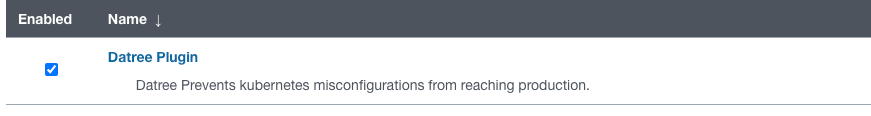
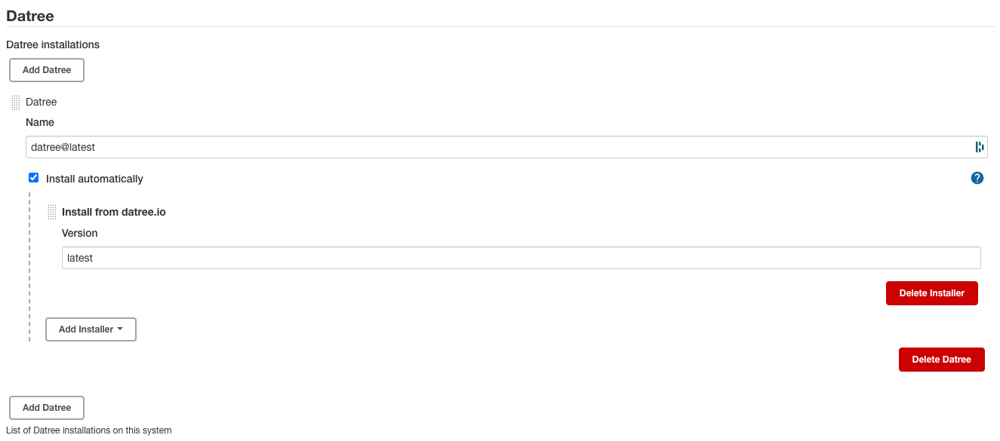
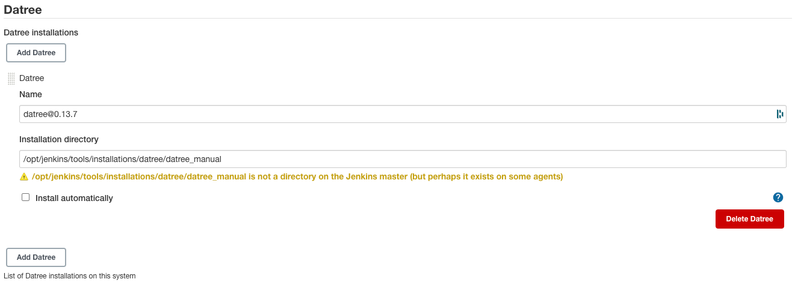
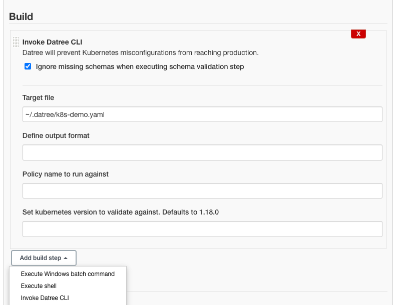

#

[](https://www.datree.io/)

Prevent Kubernetes misconfigurations from reaching production with Jenkins in just 4 steps.

Officially maintained by [Datree](https://www.datree.io/).

# Usage

To use the plugin up you will need to take the following steps in order:

1. [Install the Datree Plugin](#1-install-the-datree-plugin)
2. [Configure a Datree Installation](#2-configure-a-datree-installation)
3. [Add Datree to Your Jenkins Pipeline/Freestyle Project](#3-add-datree-to-your-project)
4. [Run a Build and Enjoy Datree Preventing Misconfigurations](#4-run-a-build-and-enjoy-datree-preventing-misconfigurations)

## 1. Install the Datree Plugin

- Go to "Manage Jenkins" > "Manage Plugins" > "Available".
- Search for "Datree".
- Install the plugin.

<blockquote>
<details>
<summary>📷 Show Installed Plugin</summary>



</details>
</blockquote>

## 2. Configure a Datree Installation

- Go to "Manage Jenkins" > "Global Tool Configuration"
- Click on "Datree Installations..."
- Click on "Add Datree"
- Configure the Installation
- Remember the "Name" as you'll need it when configuring the build step.

### Automatic Installations

The plugin can download the latest version of Datree's binaries and keep them up-to-date for you.

<blockquote>
<details>
<summary>📷 Show Preview</summary>



</details>
</blockquote>

### Manual Installations

- Download the [Datree CLI](https://github.com/datreeio/datree/releases/latest) binaries. Choose the binary suitable for
  your agent's operating system:-
- Place the binaries in a single directory on your agent.
    - Do not change the filename of the binaries.
    - Make sure you have the correct permissions to execute the binaries.
- Provide the absolute path to the directory under "Installation directory".

<blockquote>
<details>
<summary>📷 Show Preview</summary>



</details>
</blockquote>

## 3. Add Datree to your Project

This step will depend on if you're using Freestyle Projects or Pipeline Projects.

### Freestyle Projects

- Select a project
- Go to "Configure"
- Under "Build", select "Add build step" select "Invoke Datree CLI"
- Configure as needed. Click the "?" icons for more information about each option.

<blockquote>
<details>
<summary>📷 Show Preview</summary>



</details>
</blockquote>

### Pipeline Projects

Use the `datree` step as part of your pipeline script.

<blockquote>
<details>
<summary>📷 Show Example</summary>

```groovy
pipeline {
    agent any

    stages {
        stage('Build') {
            steps {
                echo 'Building...'
            }
        }
        stage('Datree Policy Check') {
            steps {
                echo 'Policy Checking...'
                datree(
                        datreeInstallation: '<Your Datree Installation Name>',
                        targetFile: '<Your Target File For Validation>'
                        // place other parameters here
                )
            }
        }
        stage('Deploy') {
            steps {
                echo 'Deploying...'
            }
        }
    }
}
```

</details>
</blockquote>

You can pass the following parameters to your `datree` step.

#### `datreeInstallation` (required)

Datree Installation Name. As configured in "[2. Configure a Datree Installation](#2-configure-a-datree-installation)".

#### `targetFile` (required)

The file we want to validate on.

#### `output` (optional, default: *none*)

Define an output format.

#### `policy` (optional)

Policy name to run against.

#### `schemaVersion` (optional, default: `1.18.0`)

Sets the Kubernetes version to validate against. Defaults to 1.18.0.

## 4. Run a Build and Enjoy Datree Preventing Misconfigurations

- Run a new build.
- Go to the build's page.
- Watch Datree preventing misconfigurations, by validating policies and more...

### Failed Installations

By default, Datree Installations will download Datree's binaries over the network
from [Datree.io Github Releases](https://github.com/datreeio/datree/releases/). If this fails there may be a network or
proxy issue. If you cannot fix the issue, you can use a [Manual Installation](#manual-installations)
instead.
